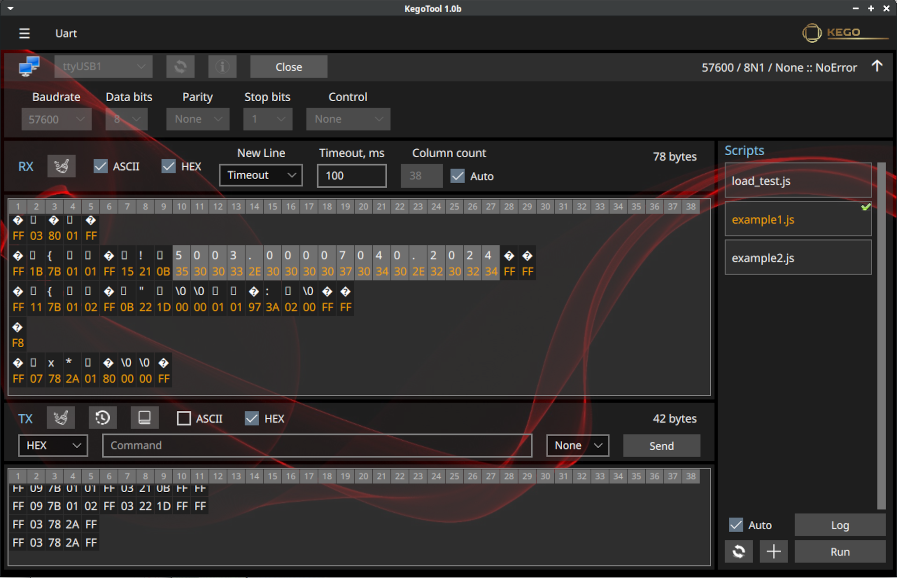

# KegoTool application

The **KegoTool** application is a cross-platform application for hardware developers and engineers who need a tool to interact with devices via a serial interface.
This is **free software**, distributed under a license **[GNU General Public License версии 3](https://www.gnu.org/licenses/)**. The **[Qt5 (5.15.2)](https://doc.qt.io/archives/qt-5.15)** libraries were used in the development, graphical interface is implemented using **[QML](https://doc.qt.io/archives/qt-5.15/topics-ui.html)**

Linux and Windows builds: [Page](https://github.com/skivigor/kegotool/releases)

#### Main functions
- byte-oriented terminal
- support for automation using scripts (JavaScript)
- calculating CRC checksums for data and files
- calculating Hash for data and files
- file comparison (comparison is provided by calculating Sha-256 for files)

## Byte-oriented serial terminal
#### Main functions
- configuring port parameters
- parameters and RX data window
- parameters and TX data window
- automation [scripts](#script) (JavaScript)

#### Data input and display modes
- asci
- hex

#### For each input mode are available
- history of entered commands
- user-fillable command dictionary

#### Data context menu
- copying data in asci format
- copying data in bin format
- copying data in hex format
- additional information about the data

## Automation scripts
**JavaScript** scripts can be used to work with the port. Script execution is provided by the class [QJSEngine](https://doc.qt.io/archives/qt-5.15/qjsengine.html)

Scripts [directory](#cfg)

#### Context menu
- editing a script in the default system editor
- deleting a script

#### Additional methods have been implemented

| **Method**       | **Description**                        |
|------------------|----------------------------------------|
| **write(data)**  | Sending data to port                   |
| **read()**       | Reading data from port                 |
| **wait(ms)**     | Delay in milliseconds                  |
| **log(message)** | Displaying a message in the log window |

#### Examples
##### Example for binary commands

    function getVoltage()
    {
        log("Read voltage")

        // Sending GetVoltage command
        var cmd = new Uint8Array([0xFF, 0x03, 0x78, 0x24, 0xFF])
        write(cmd.buffer)
        wait(200)

        // Reading the answer. Expected response: FF 05 78 24 xx xx FF (xx xx - voltage in uint16 format, LSB)
        var resp = new Uint8Array(read())
        if (resp.length !== 7) {
            log("Voltage reading error")
            return false
        }
        var volt = (resp[4] & 0x00FF) | ((resp[5] << 8) & 0xFF00)
        log("Voltage: " + volt + " mV")
        return true
    }

    getVoltage()

##### Example for text commands

    function getVoltage()
    {
        log("Read voltage")

        // Sending GetVoltage command
        var cmd = "MEAS:VOLT?\n"
        write(cmd)
        wait(200)

        // Reading the answer. Expected response: MEAS:VOLT xx\n (xx voltage)
        var resp = read().toString()
        var list = resp.trim().split(' ')
        if (list.length !== 2) {
            log("Voltage reading error")
            return false
        }
        var volt = list[1]
        log("Voltage: " + volt + " V")
        return true
    }

    getVoltage()

## Checksums
- calculation **CRC** (CRC-8, CRC-16, CRC-32, CRC-64)
- calculation **Hash**
- file **comparison** (comparison is provided by calculating Sha-256 for files)

> The user can add his own CRC types to the [configuration files](#cfg)

## Settings and configuration files
When you first launch the application, service files are automatically created in the directory **QStandardPaths::StandardLocation::AppConfigLocation**. For example:
- **Linux (~/.config/Kego/KegoTool/)**
- **Windows (C:\Users\User\AppData\Local\Kego\KegoTool)**

#### Structure of service directories
- **crc** – CRC configuration files
- **kdb** – Sqlite application database
- **scripts** – automation scripts
- **styles** – interface styles

#### Interface styles
- **Dark** (default)
- **Light**

> User can add their own interface style (they can use one of the existing ones as a basis). The catalog name will be the style name.

> Resetting the settings is accomplished by deleting the corresponding service directory. In this case, the application will restore default files the next time it's launched.

