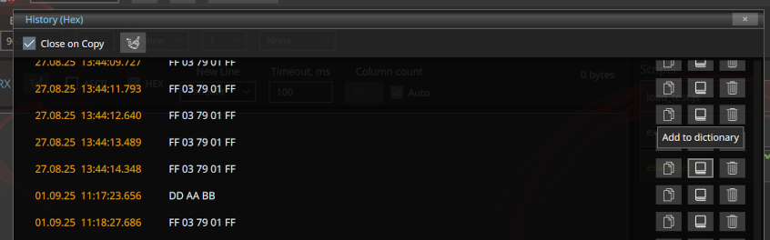

# Приложение KegoTool

Приложение **KegoTool** – это кроссплатформенное приложение для разработчиков оборудования и инженеров, которым требуется инструмент для взаимодействия с устройствами через последовательный интерфейс.
Это **свободное программное обеспечение**, распространяемое по лицензии **[GNU General Public License версии 3](https://www.gnu.org/licenses/)**. При разработке использовались библиотеки **[Qt5 (версия 5.15.2)](https://doc.qt.io/archives/qt-5.15)**, графический интерфейс реализован с использованием **[QML](https://doc.qt.io/archives/qt-5.15/topics-ui.html)**

Сборки под Linux и Windows: [Скачать](https://github.com/skivigor/kegotool/releases)

#### Основные функции
- байт-ориентированный serial терминал
- поддержка автоматизации с помощью скриптов (JavaScript)
- расчет контрольных сумм CRC для данных и файлов
- расчет Hash для данных и файлов
- сравнение файлов (сравнение обеспечивается расчетом Sha-256 для файлов)

## Байт-ориентированный serial терминал
#### Основные функции
- настройка параметров порта
- параметры и окно данных приема
- параметры и окно данных передачи
- [скрипты](#script) автоматизации (JavaScript)

#### Режимы ввода и отображения данных
- asci
- hex

#### Для каждого режима ввода доступны
- история введенных команд
- словарь команд, заполняемый пользователем

#### Контекстное меню данных
- копирование данных в asci формате
- копирование данных в bin формате
- копирование данных в hex формате
- дополнительная информация о данных

## Скрипты автоматизации
Для работы с портом могут использоваться скрипты на **JavaScript**. Выполнение скриптов обеспечивается классом [QJSEngine](https://doc.qt.io/archives/qt-5.15/qjsengine.html)

[Каталог](#cfg) размещения скриптов

#### Контекстное меню
- редактирование скрипта в системном редакторе по умолчанию
- удаление скрипта

#### Дополнительно реализованы методы

| **Method**       | **Description**             |
|------------------|-----------------------------|
| **write(data)**  | Отправка данных в порт      |
| **read()**       | Чтение данных из порта      |
| **wait(ms)**     | Задержка в милисекунда      |
| **log(message)** | Вывод сообщения в окно лога |

#### Примеры использования
##### Пример для бинарных команд

    function getVoltage()
    {
        log("Read voltage")

        // Sending GetVoltage command
        var cmd = new Uint8Array([0xFF, 0x03, 0x78, 0x24, 0xFF])
        write(cmd.buffer)
        wait(200)

        // Reading the answer. Expected response: FF 05 78 24 xx xx FF (xx xx - voltage in uint16 format, LSB)
        var resp = new Uint8Array(read())
        if (resp.length !== 7) {
            log("Voltage reading error")
            return false
        }
        var volt = (resp[4] & 0x00FF) | ((resp[5] << 8) & 0xFF00)
        log("Voltage: " + volt + " mV")
        return true
    }

    getVoltage()

##### Пример для текстовых команд

    function getVoltage()
    {
        log("Read voltage")

        // Sending GetVoltage command
        var cmd = "MEAS:VOLT?\n"
        write(cmd)
        wait(200)

        // Reading the answer. Expected response: MEAS:VOLT xx\n (xx voltage)
        var resp = read().toString()
        var list = resp.trim().split(' ')
        if (list.length !== 2) {
            log("Voltage reading error")
            return false
        }
        var volt = list[1]
        log("Voltage: " + volt + " V")
        return true
    }

    getVoltage()

## Контрольные суммы
- расчет **CRC** (CRC-8, CRC-16, CRC-32, CRC-64)
- расчет **Hash**
- **сравнение** файлов (сравнение обеспечивается расчетом Sha-256 для файлов)

> Примечание: пользователь может добавить свои типы CRC в [конфигурационные файлы](#cfg)

## Настройки и конфигурационные файлы
При первом запуске приложения автоматически создаются служебные файлы в каталоге **QStandardPaths::StandardLocation::AppConfigLocation**. Например:
- **Linux (~/.config/Kego/KegoTool/)**
- **Windows (C:\Users\User\AppData\Local\Kego\KegoTool)**

#### Структура служебных каталогов
- **crc** – конфигурационные файлы CRC алгоритмов
- **kdb** – Sqlite база данных приложения
- **scripts** – скрипты автоматизации
- **styles** – стили оформления

#### Стили оформления:
- **Dark** (по умолчанию)
- **Light**

> Пользователь может добавить свой стиль интерфейса (можно взять за основу один из существующих). Название каталога будет являться названием стиля.

> Сброс настроек осуществляется удалением соответсвующего служебного каталог. В этом случае, приложение восстановит файлы по умолчанию при следующем запуске.

